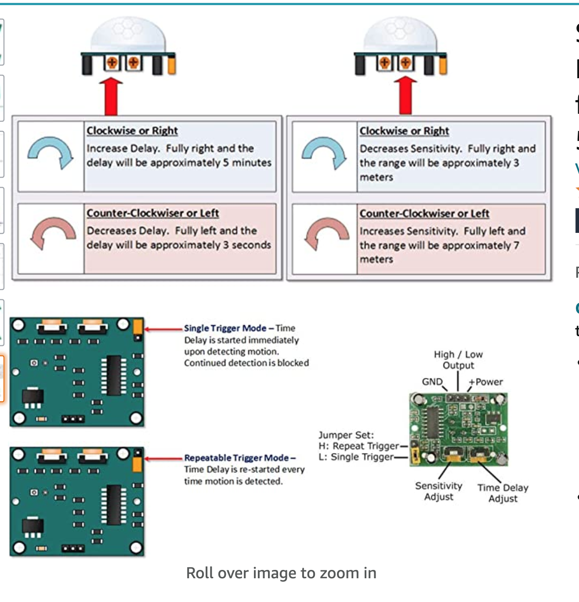

# Halloween Motion Detection

For Halloween 2021, I built a motion detector with a Raspberry Pi 3 B+ and a PIR. When motion was detected, 
it triggered the playing of some halloween type audio - John Carpenter's Halloween theme and this creepy "I want out" bit 
that I recorded off of a Halloween decoration we got from Target years ago that fit with the coffin.

For the coffin, I fashioned it out of a cardboard box and spray painted dark chestnut.

Audio was connected via bluetooth to a Cambridge Soundworks bluetooth speaker that I hid in one of the carved pumpkins.
## Raspberry PI
Raspberry Pi 3 Model B+

### Raspberry Pi OS
Raspberry PI OS 

### SW Packages
~~~~
sudo apt install rpi.gpio
sudo apt install python3-gpiozero
pip3 install pydub
~~~~

#### Documentation
* GPIOZero: https://gpiozero.readthedocs.io/en/stable/index.html
* PyDub: https://github.com/jiaaro/pydub

## PIR
Passive Infra Red Sensor

[Stemedu HC-SR501 PIR Sensor](https://www.amazon.com/gp/product/B07KBWVJMP/ref=ppx_yo_dt_b_asin_title_o08_s00?ie=UTF8&psc=1)

### Pin Out

### Potentiometer Settings

### Documentation
https://www.tweaking4all.com/hardware/pir-sensor/

### Trigger Setting
I set the trigger for this project to H as I wanted the timer on the trigger to restart each time motion was detected, otherwise
the PIR won't retrigger again until the timer expires (as is the case in the L setting).

## SW Design
Simple Gang of 4 State Machine pattern

Motion detection triggers audio playback, which then triggers a random sleep. I added a sleep state because I didn't want this firing 
immediately again after playback completes as this was intended to run on Halloween night and we tend to get a lot of kids, so there was
plenty of motion to set it off. I wanted there to be an element of surprise, so after playback, I waited before going back to the 
detect motion state.